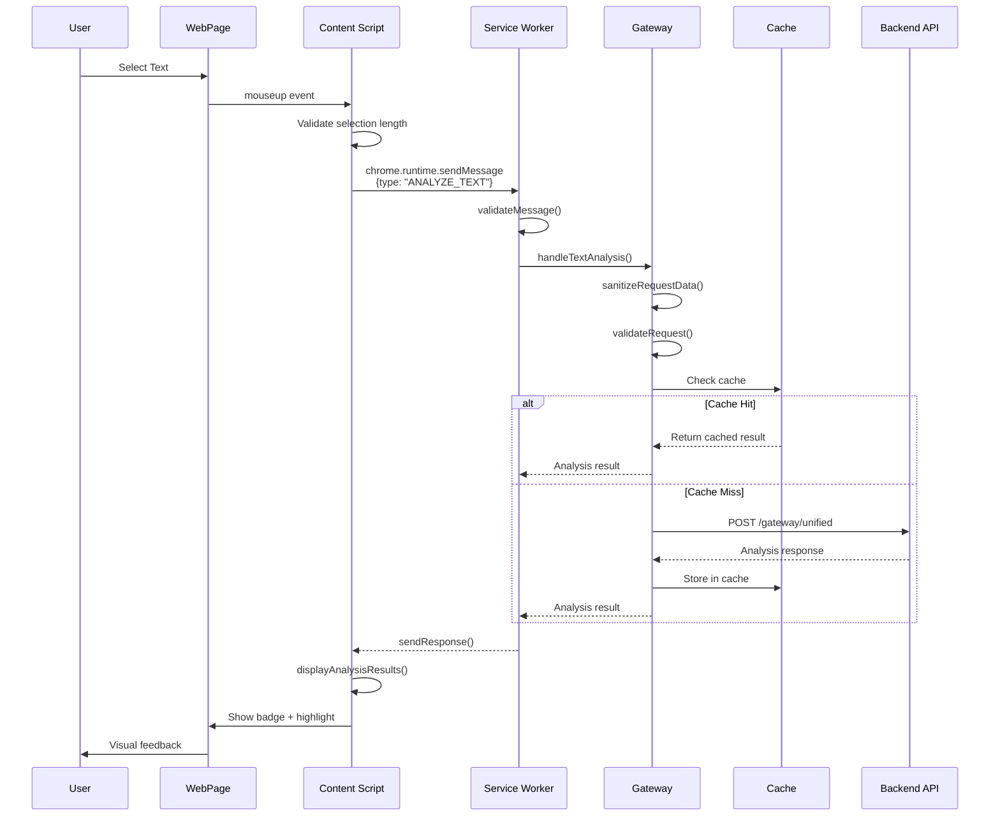
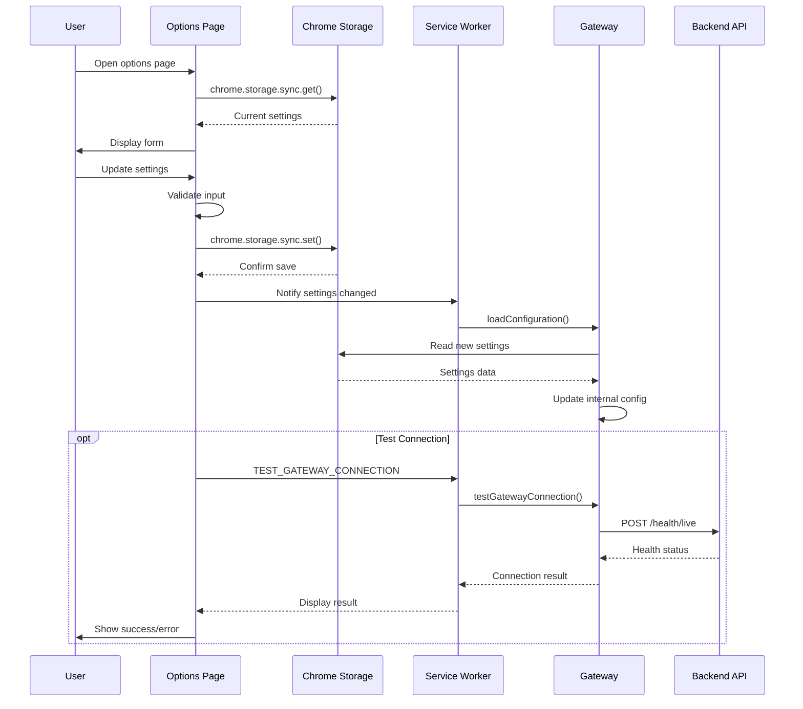
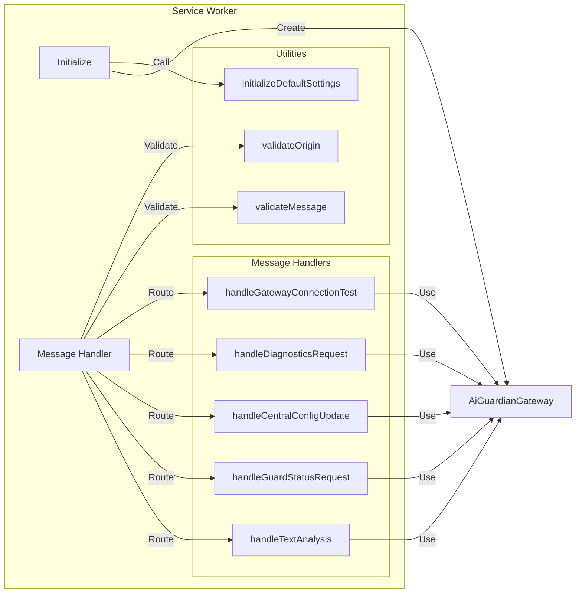
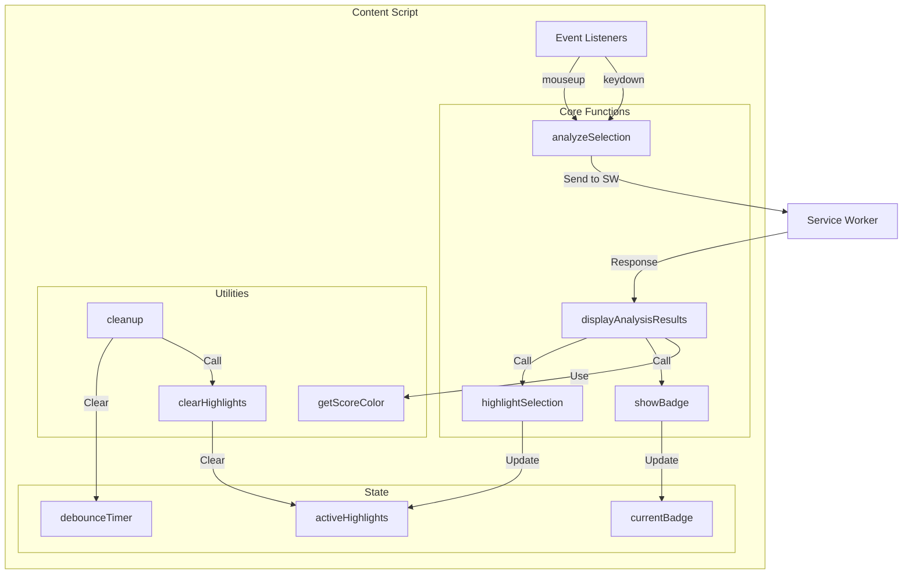
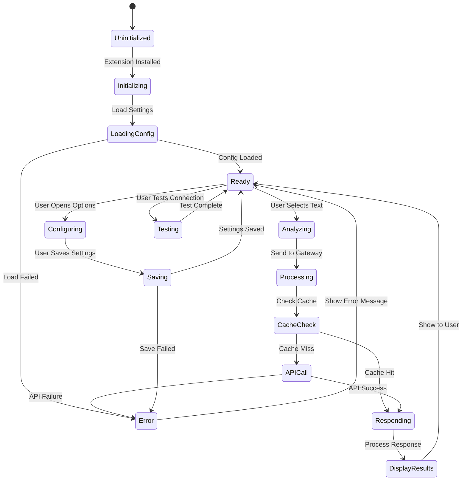
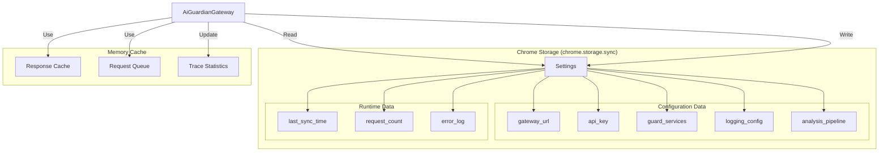
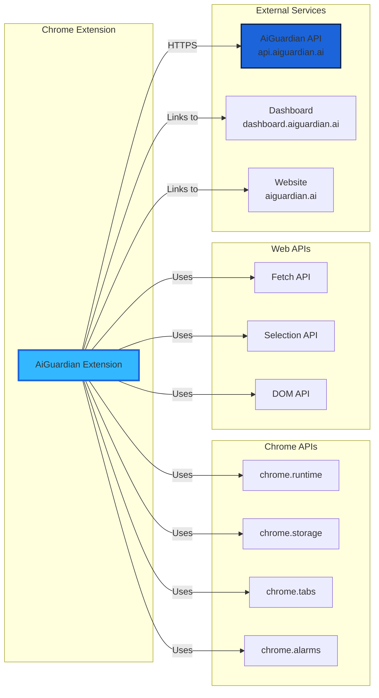
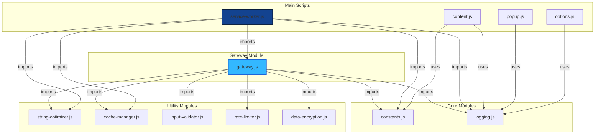
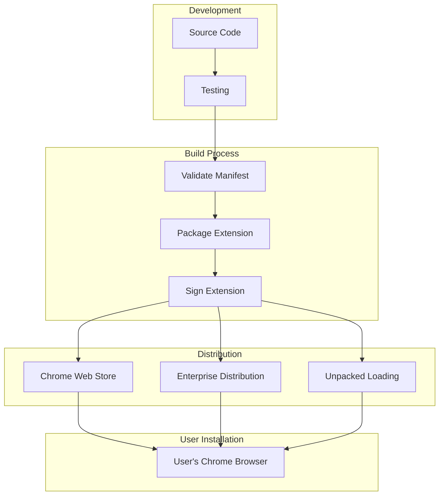

```mermaid
graph TB
    subgraph "Security Layers"
        Input[User Input]
        
        subgraph "Layer 1: Input Validation"
            LengthCheck[Length Validation]
            TypeCheck[Type Validation]
            FormatCheck[Format Validation]
        end
        
        subgraph "Layer 2: Sanitization"
            XSSFilter[XSS Filter]
            InjectionFilter[SQL Injection Filter]
            ScriptFilter[Script Tag Filter]
            EntityEncode[HTML Entity Encoding]
        end
        
        subgraph "Layer 3: Request Validation"
            EndpointCheck[Endpoint Validation]
            PayloadCheck[Payload Validation]
            OriginCheck[Origin Validation]
        end
        
        subgraph "Layer 4: Rate Limiting"
            TokenBucket[Token Bucket Algorithm]
            RequestQueue[Request Queue]
        end
        
        subgraph "Layer 5: Encryption"
            DataEncrypt[Data Encryption]
            SecureTransport[HTTPS Transport]
        end
        
        Output[Sanitized Output]
    end
    
    Input --> LengthCheck
    LengthCheck --> TypeCheck
    TypeCheck --> FormatCheck
    
    FormatCheck --> XSSFilter
    XSSFilter --> InjectionFilter
    InjectionFilter --> ScriptFilter
    ScriptFilter --> EntityEncode
    
    EntityEncode --> EndpointCheck
    EndpointCheck --> PayloadCheck
    PayloadCheck --> OriginCheck
    
    OriginCheck --> TokenBucket
    TokenBucket --> RequestQueue
    
    RequestQueue --> DataEncrypt
    DataEncrypt --> SecureTransport
    
    SecureTransport --> Output
    
    style XSSFilter fill:#FF5757,stroke:#991b1b,stroke-width:2px
    style InjectionFilter fill:#FF5757,stroke:#991b1b,stroke-width:2px
    style TokenBucket fill:#33B8FF,stroke:#1C64D9,stroke-width:2px
    style DataEncrypt fill:#33B8FF,stroke:#1C64D9,stroke-width:2px
```

# 🏗️ AiGuardian Chrome Extension - Architecture Documentation

## 📐 System Architecture

### **High-Level Architecture**

```mermaid
graph TB
    subgraph "Chrome Browser"
        UI[User Interface]
        Toolbar[Extension Icon]
        
        subgraph "Extension Components"
            Popup[Popup UI<br/>popup.html/js/css]
            Options[Options Page<br/>options.html/js]
            Content[Content Script<br/>content.js]
            SW[Service Worker<br/>service-worker.js]
            
            subgraph "Core Modules"
                Gateway[AiGuardianGateway<br/>gateway.js]
                Cache[CacheManager<br/>cache-manager.js]
                Logger[Logger<br/>logging.js]
                Validator[InputValidator<br/>input-validator.js]
                Optimizer[StringOptimizer<br/>string-optimizer.js]
                RateLimit[RateLimiter<br/>rate-limiter.js]
                Encryption[DataEncryption<br/>data-encryption.js]
                Constants[Constants<br/>constants.js]
            end
        end
        
        Storage[(Chrome Storage<br/>chrome.storage.sync)]
    end
    
    subgraph "Backend Services"
        API[AiGuardian API<br/>api.aiguardian.ai]
        
        subgraph "API Endpoints"
            Analyze[/gateway/unified<br/>Text Analysis]
            Health[/health/live<br/>Health Check]
            Logging[/api/v1/logging<br/>Centralized Logs]
            Guards[/api/v1/guards<br/>Guard Services]
            Config[/api/v1/config<br/>Configuration]
        end
    end
    
    %% User Interactions
    UI -->|Click| Toolbar
    Toolbar -->|Open| Popup
    Popup -->|Configure| Options
    
    %% Content Script Flow
    UI -->|Select Text| Content
    Content -->|Send Message| SW
    
    %% Popup Flow
    Popup -->|Send Message| SW
    Options -->|Update Settings| Storage
    
    %% Service Worker Flow
    SW -->|Initialize| Gateway
    SW -->|Read/Write| Storage
    
    %% Gateway Flow
    Gateway -->|Use| Cache
    Gateway -->|Use| Logger
    Gateway -->|Use| Validator
    Gateway -->|Use| Optimizer
    Gateway -->|Use| RateLimit
    Gateway -->|Use| Encryption
    Gateway -->|Read| Constants
    
    %% API Communication
    Gateway -->|HTTPS POST| Analyze
    Gateway -->|HTTPS POST| Health
    Gateway -->|HTTPS POST| Logging
    Gateway -->|HTTPS GET/POST| Guards
    Gateway -->|HTTPS GET/POST| Config
    
    %% Response Flow
    API -->|JSON Response| Gateway
    Gateway -->|Process| SW
    SW -->|Update| Content
    SW -->|Update| Popup
    
    style Gateway fill:#33B8FF,stroke:#1C64D9,stroke-width:3px
    style SW fill:#134390,stroke:#081C3D,stroke-width:2px
    style API fill:#1C64D9,stroke:#081C3D,stroke-width:2px
```

---

## 🔄 Data Flow Diagram

### **Text Analysis Flow**



### **Configuration Flow**



---

## 🧩 Component Architecture

### **Service Worker (Background Script)**



### **Content Script Architecture**



---

## 🔐 Security Architecture



---

## 📊 State Management



---

## 🗄️ Storage Architecture



---

## 🔌 External Dependencies



---

## 📦 Module Dependencies



---

## 🎯 Core Functionalities

### **1. Text Analysis**
- **Purpose:** Analyze selected text for bias, emotional language, and objectivity
- **Components:** Content Script → Service Worker → Gateway → Backend API
- **Output:** Bias score (0-1), bias type, confidence level

### **2. Configuration Management**
- **Purpose:** Allow users to configure backend URL, API keys, and guard services
- **Components:** Options Page → Chrome Storage → Service Worker → Gateway
- **Persistence:** Chrome Storage Sync (syncs across devices)

### **3. Connection Testing**
- **Purpose:** Verify backend API connectivity and measure response time
- **Components:** Popup → Service Worker → Gateway → Backend API
- **Output:** Connection status, response time in milliseconds

### **4. Centralized Logging**
- **Purpose:** Send all logs to backend for centralized monitoring
- **Components:** All modules → Gateway → Backend API
- **Features:** Automatic sanitization, metadata enrichment

### **5. Caching**
- **Purpose:** Reduce API calls and improve performance
- **Components:** Cache Manager → Gateway
- **Strategy:** LRU cache with TTL, request deduplication

### **6. Rate Limiting**
- **Purpose:** Prevent abuse and manage API quota
- **Components:** Rate Limiter → Gateway
- **Algorithm:** Token bucket with configurable limits

### **7. Security**
- **Purpose:** Protect against XSS, injection attacks, and unauthorized access
- **Components:** Input Validator → Gateway → All modules
- **Features:** Input sanitization, origin validation, request validation

---

## 🚀 Deployment Architecture



---

## 📈 Performance Considerations

### **Optimization Strategies:**

1. **Caching**
   - Response caching with TTL
   - Request deduplication
   - LRU eviction policy

2. **Debouncing**
   - Text selection debounced (300ms)
   - Prevents excessive API calls

3. **Lazy Loading**
   - Gateway initialized on demand
   - Modules loaded only when needed

4. **String Optimization**
   - Efficient string operations
   - Memory-conscious processing

5. **Rate Limiting**
   - Token bucket algorithm
   - Prevents API quota exhaustion

---

**Last Updated:** October 26, 2025  
**Version:** 1.0.0  
**Architecture Status:** ✅ Production Ready

