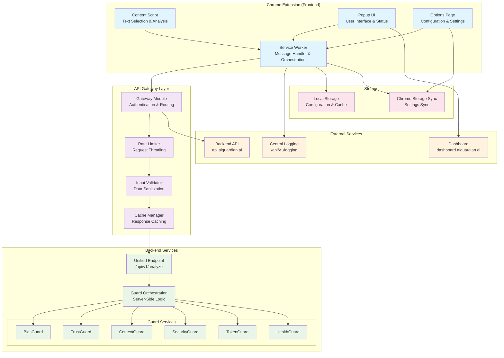
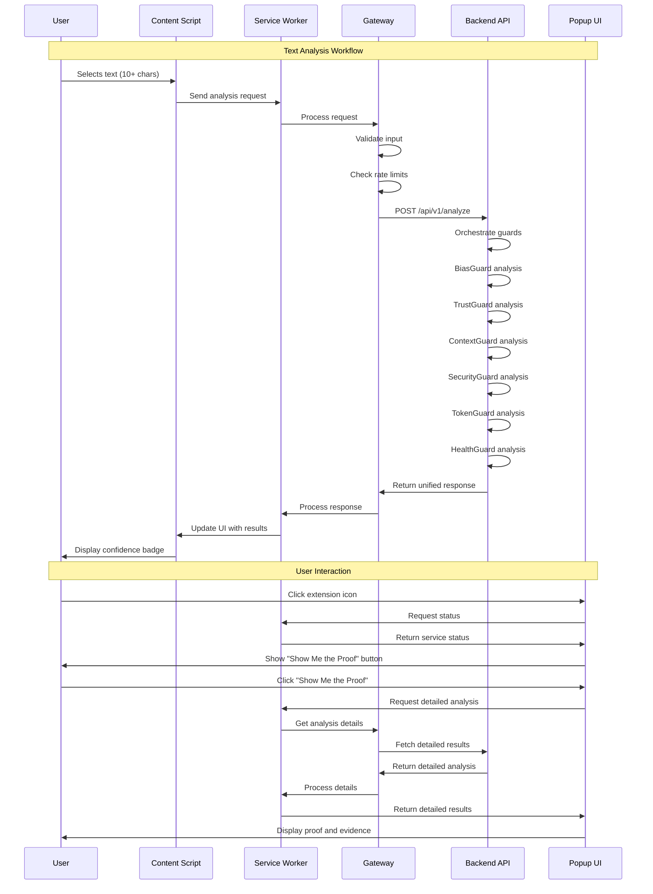
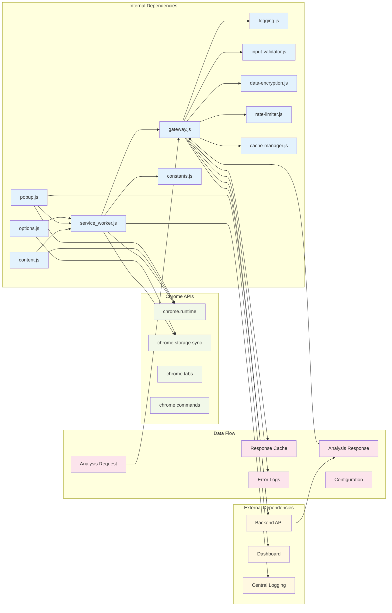
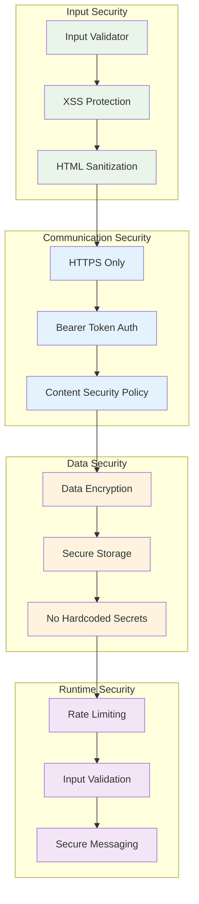
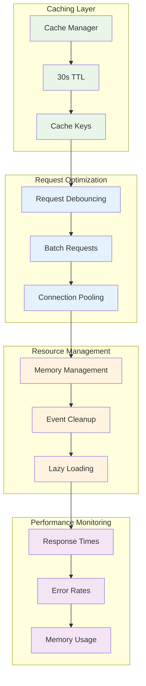
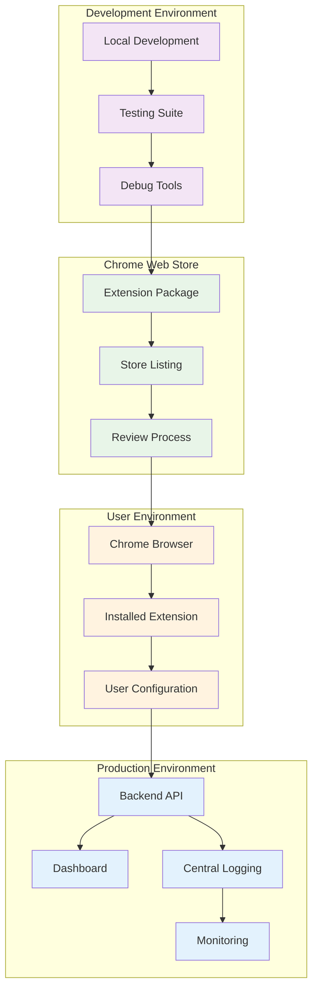

# 🏗️ AiGuardian Chrome Extension - Architecture Documentation

## System Architecture

## Core Functionality Flow

## Dependencies & Data Flow

## Security Architecture

## Performance Architecture

## Deployment Architecture

## Key Architectural Decisions

### 1. Unified Endpoint Pattern
- **Single API Endpoint**: `/api/v1/analyze` handles all analysis requests
- **Backend Orchestration**: All guard logic executed server-side
- **Simplified Frontend**: Extension only handles UI and basic configuration
- **Scalable Architecture**: Easy to add new guards without frontend changes

### 2. Security-First Design
- **Input Validation**: All user inputs sanitized before processing
- **XSS Protection**: Script tag removal and HTML sanitization
- **Secure Communication**: HTTPS-only with bearer token authentication
- **Data Encryption**: Sensitive data encrypted in storage

### 3. Performance Optimization
- **Response Caching**: 30-second TTL for analysis results
- **Request Debouncing**: 300ms debounce to prevent spam
- **Memory Management**: Event listener cleanup and efficient resource usage
- **Connection Pooling**: Reuse connections for better performance

### 4. Transparency & Trust
- **Proof-First Approach**: "Show Me the Proof" button for evidence
- **Confidence Scores**: Clear indicators of analysis reliability
- **Uncertainty Flagging**: "I'm not sure" responses when uncertain
- **Audit Trails**: Complete transparency in decision making

### 5. Skeptical Engineer Focus
- **No Hype Language**: Honest about limitations and uncertainties
- **Transparent Logging**: "We don't claim perfect security. We claim transparent failure logging."
- **Evidence-Based Results**: Show reasoning, not just conclusions
- **Trust Through Transparency**: Build trust by being honest about limitations

## Future Considerations

### Scalability
- **Microservices Architecture**: Each guard could become a separate service
- **Load Balancing**: Distribute analysis requests across multiple instances
- **Caching Layers**: Redis for response caching, CDN for static assets

### Enhanced Features
- **Real-time Analysis**: WebSocket connections for live analysis
- **Custom Pipelines**: User-defined analysis workflows
- **API Versioning**: Support for multiple API versions
- **Webhook Integration**: Real-time notifications for analysis results

### Monitoring & Observability
- **Metrics Collection**: Response times, error rates, usage patterns
- **Distributed Tracing**: Track requests across all services
- **Alerting**: Proactive monitoring and incident response
- **Analytics**: User behavior and feature usage tracking